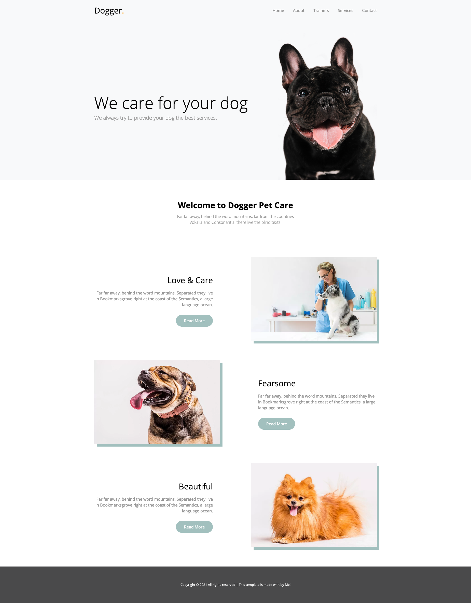

# Dogger

Vous venez de trouver un nouveau client et celui-ci à besoin de vous pour intégrer une maquette fournie.  
Toutes les images, les couleurs et la police de caractères vous sont fournis :

## Éléments

Couleurs :
```
Blanc : #ffffff; OK
Noir : #000000; OK
Gris clair : #f8f9fa; OK
Gris : #999999; OK
Gris foncé : #4a4a4b; OK
Vert : #a2c0be; OK
Vert foncé : #567876; OK
Orange : #ff9900; OK
```

Police de caractères
```
Open Sans en 300, 400, 600 et 700 OK
```

Les boutons change de couleur au passage de la souris, le fond doit devenir noir. La transition doit se faire en douceur (voir les animations CSS).
De même que les liens se trouvant dans le menu, ils passent du gris clair au gris foncé en douceur.

## À savoir

Toutes les classes, ID et autres éléments doivent être en anglais.
Seuls les commentaires peuvent se trouver en français.

Vous devez être le plus fidèle possible à la maquette fournis.  
**Le client est exigeant et refusera le "à peu près".**

## Preview


